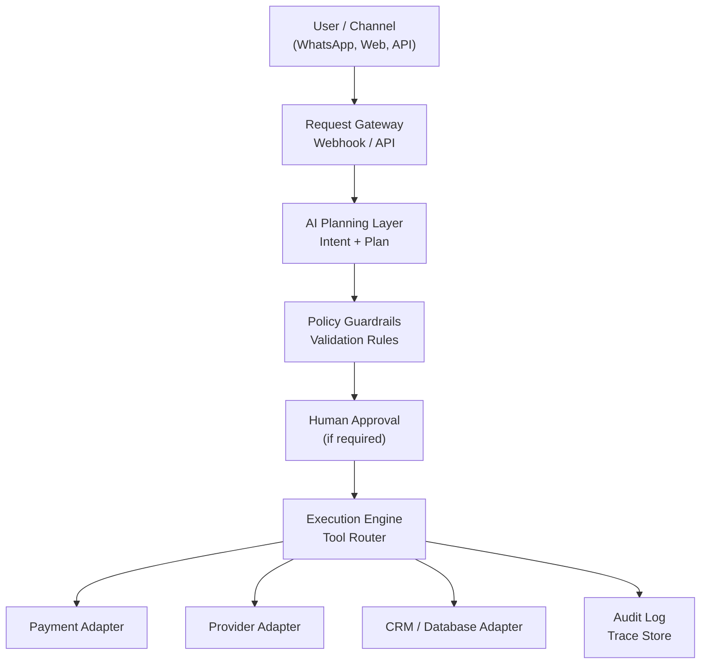
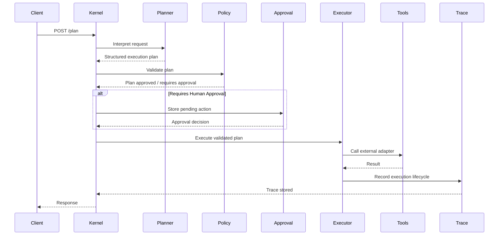

<p align="center">

AI Agent Orchestrator — Kernel

</p>

<p align="center">

Python • FastAPI • AI Planning • Human-in-the-Loop • MIT License

</p>

# Kernel — AI Orchestrator Backend

Kernel is a modular AI orchestration backend that receives requests, generates structured execution plans, routes actions through tools or human approval, and records every step with full operational traceability.

Instead of behaving like a traditional chatbot, Kernel acts as a control layer for real operational workflows. The system interprets requests, plans actions, enforces safety rules, integrates with external tools, and maintains a complete audit trail of decisions and outcomes.

---

## Why this exists

Many AI “bots” fail in production because they mix free-form conversation with direct system side effects.

Kernel demonstrates a safer and more reliable architecture where **AI reasoning is separated from deterministic execution**.

The system introduces a controlled operational flow:

- AI Decision Layer (probabilistic reasoning)
- Tool Executor (deterministic operations)
- Human-in-the-Loop approval checkpoints
- External API adapters
- Structured audit logging and traceability

This design allows AI systems to operate safely in real business environments.

---

## Design Philosophy

Kernel is intentionally designed as a **control layer for operational AI systems**, not as a conversational assistant.

The project focuses on **safe AI orchestration**, where reasoning, validation, approval, and execution remain clearly separated.

---

## Non-Goals

Kernel is **not intended to be**:

- a chatbot framework
- an LLM wrapper library
- a workflow engine replacement
- a full AI agent platform

Instead, Kernel demonstrates the **core architectural pattern required to safely integrate AI into real operational systems**.

---

## Kernel Architecture

<div align="center">



</div>

---

## Runtime Execution Flow

The following sequence diagram illustrates how a request travels through the Kernel orchestration lifecycle.



---

## Core Principles

**Separation of Concerns**  
AI decides *what should happen*, tools execute *deterministic actions*.

**No Direct Side Effects from Free-Form Text**  
All operational actions must pass through structured execution plans.

**Human-in-the-Loop Safety**  
Sensitive or irreversible actions require human approval.

**Provider Abstraction**  
External APIs are accessed through adapters so providers can be swapped without affecting the orchestration layer.

**Observability by Design**  
Every request is tracked with a trace ID to provide full lifecycle visibility.

---

## Example Operational Flow

1. A user request arrives via webhook or API  
2. The system normalizes the request and assigns a trace ID  
3. The AI planning layer interprets the request and generates an execution plan  
4. Policy rules validate whether the plan is allowed to proceed  
5. If necessary, the plan is sent for human approval  
6. The execution engine calls the required tools or services  
7. Results are returned and the full lifecycle is recorded in the trace log

---

## Demo Scenario

Kernel’s reference demo flow illustrates how an operational request moves through the full orchestration lifecycle.

This scenario demonstrates the core Kernel principle:

**AI plans → policies validate → humans approve when needed → tools execute deterministically → every step is traced.**

### Example Scenario — Payment Link Approval Flow

A request arrives asking the system to generate a payment link for a customer order.  
Kernel does not execute the action directly from free-form text. Instead, it converts the request into a controlled operational workflow.

The system performs the following steps:

1. Receive and normalize the request  
2. Generate a structured execution plan  
3. Validate the plan through policy rules  
4. Pause for human approval because the action affects an external financial system  
5. Execute the approved action through the payment adapter  
6. Return the result and record the full execution trace

Core flow:

```
Request → Plan → Validate → Approve → Execute → Trace
```

## Hammer Radar Local Approval UI

Hammer Radar includes a localhost-only approval console for recording operator intent:

```bash
systemctl status hammer-approval-api.service --no-pager
```

Open:

```text
http://127.0.0.1:8015/ui
```

The UI records decisions only through the local Approval API. It does not place orders, does not call Binance, and keeps `live_execution_enabled=false` / `order_placed=false`.

R38 adds record-only operator actions and Binance live API readiness metadata:

```text
POST /operator/actions
GET /operator/actions
GET /operator/actions/{action_id}
GET /operator/latest
POST /operator/parse-action
GET /binance-live/status
```

R39 adds an exact live approval gate for evaluation only:

```text
POST /operator/live-approval/evaluate
GET /operator/live-approval/requests
GET /operator/live-approval/requests/{request_id}
```

The only live approval intent format recognized by the parser is:

```text
LIVE APPROVE <signal_id>
```

Example:

```text
LIVE APPROVE BTCUSDT|13m|long|2026-05-01T22:31:59.999000+00:00
```

Vague commands such as `trade now live`, `open live`, `buy now`, `sell now`, `market buy`, `market sell`, `50x`, `live approve latest`, and `live approve all` remain blocked or rejected. Exact live approval requires `signal_id`. R39 evaluates only; no live orders. Execution remains disabled. R39 does not place orders and does not create signed order payloads.

R40 adds a strategy performance audit and live-eligibility recommendation matrix:

```text
GET /strategy-performance/summary
GET /strategy-performance/timeframes
GET /strategy-performance/entry-modes
GET /strategy-performance/live-eligibility
```

R40 is an audit/reporting phase only. It reads local paper logs, summarizes timeframe/direction/entry-mode performance, and recommends future tiny-live candidate classes without granting execution permission. Live eligibility is recommendation only, not permission. Future tiny-live still requires exact `LIVE APPROVE <signal_id>` and all safety gates. R40 does not place live orders and does not create signed order payloads.

R41 adds a strategy promotion watcher:

```text
GET /strategy-promotion/status
POST /strategy-promotion/check
GET /strategy-promotion/events
GET /strategy-promotion/events/{event_id}
```

R41 records and reports when strategy buckets approach or cross R40 promotion thresholds. Promotion is review only, not permission to trade. It does not place orders, does not enable live execution, and does not create signed payloads. Promotion messages say that exact `LIVE APPROVE <signal_id>` and all live safety gates are still required, execution remains disabled, and no live orders are available.

R42 adds a promoted strategy live preflight pack:

```text
GET /live-preflight/promoted-strategy
POST /live-preflight/evaluate
GET /live-preflight/packs
GET /live-preflight/packs/{preflight_id}
```

R42 bridges strategy-level promotion to signal-level readiness. It reports whether the promoted `BTCUSDT|13m|long|ladder_close_50_618` strategy has a fresh matching BTCUSDT 13m long signal, then summarizes readiness, ticket, dry-run, and live-safety gates when a signal exists. If no fresh matching signal exists, it returns `WAITING_FOR_FRESH_PROMOTED_SIGNAL`. R42 is preflight/reporting only: it does not place orders, does not enable live execution, and does not create signed payloads. Fresh signal approval still requires exact `LIVE APPROVE <signal_id>` and all safety gates. Development can proceed without a fresh signal; execution cannot.

R43 adds a default-blocked Binance Futures tiny-live connector:

```text
GET /binance-live/connector-status
POST /binance-live/payload-preview
POST /binance-live/test-order
POST /binance-live/execute
GET /binance-live/connector-attempts
```

R43 does not loosen strategy gates and does not allow random altcoins, random timeframes, shorts, or vague live commands. Default connector mode is `DRY_RUN_ONLY`. Payload preview is not permission to execute, test-order mode is not live order placement, and live order placement remains blocked unless every gate is explicit: `LIVE_ORDER_ENABLED`, Binance live env enabled, live execution enabled, live orders allowed, kill switch off, exact `LIVE APPROVE <signal_id>`, fresh promoted BTCUSDT 13m long `ladder_close_50_618` signal, valid ticket, valid dry-run, passing live-safety, 44 USDT max, 3x max, isolated margin, and one-trade locks. R43 stores sanitized connector attempts and does not create signed payloads in `DRY_RUN_ONLY`.

R44 adds a signed Binance USD-M Futures test-order harness for:

```text
POST /fapi/v1/order/test
```

The Binance test-order endpoint validates a request but does not submit it to the matching engine. R44 does not call `POST /fapi/v1/order`, does not place real orders, and keeps default mode as `DRY_RUN_ONLY`. Signed payload creation is blocked in `DRY_RUN_ONLY` and allowed only after explicit `TEST_ORDER_ONLY` gates pass. Real network test-order calls require `HAMMER_BINANCE_TEST_ORDER_NETWORK_ENABLED=true`; otherwise `/binance-live/test-order` remains blocked unless an explicitly requested mock adapter is used. API keys, API secrets, raw signatures, and raw auth headers are never persisted or shown; signature values are hidden in sanitized records.

R45 prepares the first real Binance USD-M Futures live order endpoint support for:

```text
POST /fapi/v1/order
```

R45 remains default-blocked and safe to merge with production switches off. It does not trade random altcoins, shorts, wrong timeframes, or non-promoted strategies. Live execute requires exact `LIVE APPROVE <signal_id>`, a fresh promoted BTCUSDT 13m long signal, valid preflight, successful prior test-order when required, one-trade locks, isolated margin, 44 USDT max, and 3x max. R45 blocks if the protective stop/take-profit live order path is not implemented, so it should not place naked live entries. The test endpoint remains `POST /fapi/v1/order/test`; the real endpoint is prepared only behind explicit gates.

R46 adds the protective order safety harness:

```text
GET /binance-live/protective-status
POST /binance-live/protective-preview
POST /binance-live/protective-test
GET /binance-live/protective-attempts
```

R46 keeps `HAMMER_PROTECTIVE_ORDERS_REQUIRED=true` by default, `HAMMER_PROTECTIVE_ORDERS_ENABLED=false` by default, and `HAMMER_PROTECTIVE_ORDER_MODE=PREVIEW_ONLY` by default. Protective stop-loss and take-profit handling is required before live entry can be allowed. The harness can build sanitized stop-loss and take-profit previews for the promoted BTCUSDT 13m long ticket, and mock protective validation is explicit. Real protective orders are not sent by default, no naked live entries are allowed, and `/binance-live/execute` remains blocked with `protective stop/take-profit live order path not ready` when the protective path is not ready. Option A is a future explicitly enabled protective path; Option B is the current safe behavior: block live entry if protective stop/take-profit cannot be guaranteed.

R47 adds the first protected tiny-live runbook and enablement gate:

```text
GET /first-live/runbook
POST /first-live/evaluate
GET /first-live/evaluations
GET /first-live/evaluations/{evaluation_id}
```

R47 is a runbook and go/no-go checklist only. It does not place orders, does not enable live trading, does not modify env files automatically, does not restart systemd, and does not call Binance network. The first live order remains one protected BTCUSDT 13m long trade only: no random altcoins, no shorts, no vague commands, exact `LIVE APPROVE <signal_id>` required, test-order validation required, protective stop-loss and take-profit required, 44 USDT max, 3x max, isolated margin, one trade per day, and no duplicate signal order. A `GO_FOR_ENABLEMENT_PLAN` response means the operator may manually follow the enablement plan; it is not automatic execution. After the first attempt, the system must be locked back down.

R48 adds the Telegram inbound operator bridge and first-live approval challenge flow:

```text
POST /telegram/operator-command
POST /telegram/first-live/challenge
POST /telegram/first-live/reply
GET /telegram/first-live/challenges
GET /telegram/first-live/challenges/{challenge_id}
GET /telegram/operator-commands
```

Telegram is the preferred phone operator surface for status, evaluation, and approval intent. Cloudflare dashboard exposure is not required for phone operation, and the `127.0.0.1` dashboard remains desktop-local. R48 does not change the API bind address, does not modify Cloudflare config, does not place orders, does not flip env switches, does not restart systemd, and does not call Binance network.

First live approval uses a signal-bound challenge/reply flow. Raw `YES` is rejected. Only `YES <code>` for an active, unexpired one-time challenge is accepted. A valid code records exact approval intent for the matching `signal_id` through the existing `LIVE APPROVE <signal_id>` gate, but approval is not execution and no live order is placed by challenge approval. Execution still requires all runbook, preflight, test-order, protective, live-safety, and deliberate live enablement gates. Paper-only alerts, including 8m shorts, may be acknowledged or recorded as paper/manual intent only; they never create live approval challenges.

The live credential env file is expected at:

```text
/home/josue/.config/hammer-radar/binance-live.env
```

Recommended permissions and defaults:

```bash
chmod 700 /home/josue/.config/hammer-radar
chmod 600 /home/josue/.config/hammer-radar/binance-live.env
```

```text
HAMMER_BINANCE_LIVE_ENABLED=false
HAMMER_BINANCE_CONNECTOR_MODE=DRY_RUN_ONLY
HAMMER_BINANCE_TEST_ORDER_NETWORK_ENABLED=false
HAMMER_BINANCE_BASE_URL=https://fapi.binance.com
HAMMER_BINANCE_RECV_WINDOW=5000
HAMMER_LIVE_EXECUTION_ENABLED=false
HAMMER_ALLOW_LIVE_ORDERS=false
HAMMER_GLOBAL_KILL_SWITCH=true
HAMMER_LIVE_ALLOWED_SYMBOLS=BTCUSDT
HAMMER_LIVE_MAX_POSITION_USD=44
HAMMER_LIVE_MAX_LEVERAGE=3
HAMMER_LIVE_MARGIN_MODE=isolated
HAMMER_LIVE_REQUIRE_EXACT_APPROVAL=true
HAMMER_LIVE_MAX_TRADES_PER_DAY=1
```

Before any future live API use, the desktop public IP should be allowlisted in Binance API Management. R38/R39/R40/R41/R42/R43 default paths do not submit orders, do not create signed order payloads, and only report whether key/secret variables are present.

## Hammer Radar Friday Manual Tiny-Live Protocol

The first manual tiny-live workflow is documented in:

```text
docs/hammer_radar_manual_tiny_live_protocol.md
```

Use the local approval UI first:

```text
http://127.0.0.1:8015/ui
```

Log the decision before any manual exchange action. After exit, record the manual result:

```bash
HAMMER_RADAR_LOG_DIR=/home/josue/workspace/kernel/ai-agent-orchestrator-main/logs/hammer_radar_forward \
  .venv/bin/python -m src.app.hammer_radar.operator.inspect log-manual-outcome \
  --signal-id "..." \
  --result skipped \
  --notes "manual review"
```

Review manual outcomes:

```bash
HAMMER_RADAR_LOG_DIR=/home/josue/workspace/kernel/ai-agent-orchestrator-main/logs/hammer_radar_forward \
  .venv/bin/python -m src.app.hammer_radar.operator.inspect manual-outcomes
```

The app records intent and outcomes only. It does not place orders, does not call Binance, and keeps `live_execution_enabled=false` / `order_placed=false`.

### Example Request

```json
{
  "message": "Generate a payment link for order #4821 for 1,250 MXN and send it back to the customer."
}
```

### Example Execution Plan

```json
{
  "intent": "create_payment_link",
  "requires_approval": true,
  "entities": {
    "order_id": "4821",
    "amount": 1250,
    "currency": "MXN"
  }
}
```

### Example Tool Execution Result

```json
{
  "status": "success",
  "payment_url": "https://payments.example.com/pay_8FJ29KLM"
}
```

### Example Final Response

```json
{
  "status": "completed",
  "message": "Payment link generated successfully."
}
```

### Observability

Each request is tracked through a **trace ID**, allowing the system to record:

- request reception
- plan generation
- policy validation
- approval events
- tool execution
- final response

This traceability ensures the system remains **auditable, debuggable, and safe for operational use**.

---

## Architecture Goals

Kernel is designed to support real operational environments where AI systems must be:

- **Reliable**
- **Traceable**
- **Auditable**
- **Provider-agnostic**
- **Safe to integrate into business workflows**

---

## API Surface

Kernel exposes a minimal API surface aligned to the orchestration lifecycle.

### Endpoints

- `POST /plan`  
  Accepts an inbound request, normalizes it, assigns a trace ID, and returns a structured execution plan.

- `POST /approve`  
  Records a human decision for workflows that require approval before execution.

- `POST /execute`  
  Executes a previously planned and validated workflow through deterministic tool adapters.

- `GET /trace/{trace_id}`  
  Returns the lifecycle history, status changes, and execution trace for a specific request.

- `GET /health`  
  Provides a basic health check for service monitoring and readiness.

### Example Lifecycle

```
POST /plan → POST /approve → POST /execute → GET /trace/{trace_id}
```

This API design keeps reasoning, approval, execution, and observability clearly separated.

---

## Project Structure

The project is organized to keep reasoning, policy, execution, and observability clearly separated.

```
ai-agent-orchestrator/
├── src/
│   ├── api/            # HTTP routes and request/response entrypoints
│   ├── core/           # Configuration, shared models, and base orchestration logic
│   ├── planner/        # Intent detection and structured execution planning
│   ├── policy/         # Validation rules, guardrails, and approval requirements
│   ├── execution/      # Tool routing and deterministic action handlers
│   ├── adapters/       # External service integrations
│   ├── observability/  # Trace logging, audit events, and lifecycle tracking
│   └── main.py         # Application entrypoint
├── tests/              # Unit and integration tests
├── QUICKSTART.md       # Local setup and example API usage
└── README.md           # Architecture, principles, and project overview
```

This structure reflects the main Kernel principle:  
**AI plans → policies validate → humans approve → tools execute → everything is traced.**

---

## Development Roadmap

The project is being built incrementally as a production-oriented reference implementation.

### Phase 1 — Core Orchestration Foundation
- Request normalization
- Structured planning flow
- Trace ID generation
- Health endpoint
- Minimal API scaffold

### Phase 2 — Policy and Approval Layer
- Guardrail validation
- Approval state handling
- Human-in-the-loop workflow support
- Approval audit events

### Phase 3 — Deterministic Execution
- Tool router
- Payment adapter reference implementation
- External service abstraction layer
- Retry and failure handling

### Phase 4 — Observability and Testing
- Full request lifecycle tracing
- Structured logs
- Integration tests for end-to-end flows
- Error visibility and debugging support

### Phase 5 — Production Readiness
- Authentication and authorization
- Persistent storage for traces and approvals
- Rate limiting and operational safeguards
- Deployment packaging and environment configuration

---

## Getting Started

For setup instructions and example API usage, see:

[QUICKSTART.md](./QUICKSTART.md)

---

## Hammer Radar Docker

Hammer Radar can also run in Docker without replacing the existing direct Python and systemd workflow used in this repo.

Build and run:

```bash
docker compose -f docker-compose.radar.yml up --build
```

Detached run:

```bash
docker compose -f docker-compose.radar.yml up -d --build
```

Logs:

```bash
docker compose -f docker-compose.radar.yml logs -f hammer-radar
```

Stop:

```bash
docker compose -f docker-compose.radar.yml down
```

Persisted NDJSON files:

```bash
ls -lah logs/hammer_radar
tail -n 5 logs/hammer_radar/signals.ndjson
tail -n 5 logs/hammer_radar/outcomes.ndjson
tail -n 5 logs/hammer_radar/positions.ndjson
tail -n 5 logs/hammer_radar/position_events.ndjson
```

Paper execution is paper-only in this phase. Paper positions are stored in `logs/hammer_radar/positions.ndjson`, lifecycle events are stored in `logs/hammer_radar/position_events.ndjson`, and no live Binance trading exists yet.

Safe forward paper evidence can be captured into a separate archive directory without touching the default or historical archives:

```bash
HAMMER_RADAR_LOG_DIR=/tmp/hammer_radar_forward \
HAMMER_RADAR_MODE=paper \
timeout 60s .venv/bin/python -m src.app.hammer_radar.main
```

`HAMMER_RADAR_MODE=paper` is an alias for the safe paper execution mode. The runtime prints the selected `archive_log_dir` and `execution_mode`, uses the paper adapter only, and writes signal/outcome/paper NDJSON files to `HAMMER_RADAR_LOG_DIR` when provided.

Inspection commands:

```bash
.venv/bin/python -m src.app.hammer_radar.operator.inspect summary
.venv/bin/python -m src.app.hammer_radar.operator.inspect signals --limit 5
.venv/bin/python -m src.app.hammer_radar.operator.inspect outcomes --limit 5
.venv/bin/python -m src.app.hammer_radar.operator.inspect positions --status open
.venv/bin/python -m src.app.hammer_radar.operator.inspect positions --status closed
.venv/bin/python -m src.app.hammer_radar.operator.inspect events --limit 20
.venv/bin/python -m src.app.hammer_radar.operator.inspect r9-coverage
```

Execution adapters now exist under `src.app.hammer_radar.execution`. The current execution mode defaults to `paper`, the `binance_stub` adapter is only a non-trading boundary for future work, and no live Binance trading or real order placement exists yet.

Safety/readiness check:

```bash
.venv/bin/python -m src.app.hammer_radar.execution.safety check
```

Live trading is still disabled. Supported execution modes remain `paper` and `binance_stub`, and any future Binance live integration requires a separate approval phase.

Operator delivery bridge:

```bash
curl -s http://127.0.0.1:8015/notifications/status | jq .
curl -s -X POST http://127.0.0.1:8015/notifications/check -H 'Content-Type: application/json' -d '{"send":false,"channel":"telegram"}' | jq .
curl -s http://127.0.0.1:8015/notifications/alerts | jq .
curl -s http://127.0.0.1:8015/candidates | jq .
curl -s http://127.0.0.1:8015/readiness | jq .
```

Notification checks now separate strict `LIVE_READY` alerts from operator-visibility alerts for fresh BTCUSDT `ACTIONABLE_PAPER` candidates that meet the configured strategy hammer-strength minimum. `EXPIRING_SOON` alerts surface fresh candidates close to the freshness gate, and `EXPIRED_MISSED` records diagnostics without Telegram spam by default. Candidate-level dedupe prevents the same `signal_id` from repeatedly alerting, while the global minimum alert interval still applies to Telegram sends. This layer is alert-only: `live_execution_enabled=false`, `order_placed=false`, ETH and alt symbols remain paper/watch-only, and live safety gates are not loosened.

Truth commands:

```bash
.venv/bin/python -m src.app.hammer_radar.operator.truth summary
.venv/bin/python -m src.app.hammer_radar.operator.truth top-setups --limit 10
.venv/bin/python -m src.app.hammer_radar.operator.truth weak-setups --limit 10
.venv/bin/python -m src.app.hammer_radar.operator.truth by-entry-mode
.venv/bin/python -m src.app.hammer_radar.operator.truth by-timeframe
.venv/bin/python -m src.app.hammer_radar.operator.truth strategy-eligible
.venv/bin/python -m src.app.hammer_radar.operator.truth tradable-only
```

Supported strategy timeframes are `13m`, `55m`, `666m`, `4H`, `13H`, and `13D`. Strategy filtering is config-driven via `src.app.hammer_radar.operator.strategy_config`, defaults remain conservative, and the system is still paper-only.

Paper exit rules now support stop-loss, take-profit by R multiple, and max-hold candles. Conservative same-candle behavior is stop-first if both stop and TP are touched, and all of this remains paper-only.

Additional Docker notes for Hammer Radar are in [docs/hammer_radar_docker.md](./docs/hammer_radar_docker.md).

---

## License

MIT
