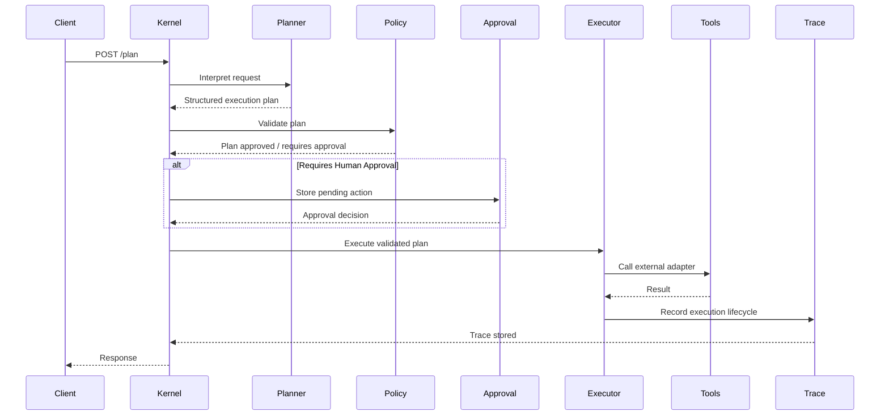

<p align="center">

AI Agent Orchestrator — Kernel

</p>

<p align="center">

Python • FastAPI • AI Planning • Human-in-the-Loop • MIT License

</p>

# Kernel — AI Orchestrator Backend

Kernel is a modular AI orchestration backend that receives requests, generates structured execution plans, routes actions through tools or human approval, and records every step with full operational traceability.

Instead of behaving like a traditional chatbot, Kernel acts as a control layer for real operational workflows. The system interprets requests, plans actions, enforces safety rules, integrates with external tools, and maintains a complete audit trail of decisions and outcomes.

---

## Why this exists

Many AI “bots” fail in production because they mix free-form conversation with direct system side effects.

Kernel demonstrates a safer and more reliable architecture where **AI reasoning is separated from deterministic execution**.

The system introduces a controlled operational flow:

- AI Decision Layer (probabilistic reasoning)
- Tool Executor (deterministic operations)
- Human-in-the-Loop approval checkpoints
- External API adapters
- Structured audit logging and traceability

This design allows AI systems to operate safely in real business environments.

---

## Design Philosophy

Kernel is intentionally designed as a **control layer for operational AI systems**, not as a conversational assistant.

The project focuses on **safe AI orchestration**, where reasoning, validation, approval, and execution remain clearly separated.

---

## Non-Goals

Kernel is **not intended to be**:

- a chatbot framework
- an LLM wrapper library
- a workflow engine replacement
- a full AI agent platform

Instead, Kernel demonstrates the **core architectural pattern required to safely integrate AI into real operational systems**.

---

## Kernel Architecture

```mermaid
flowchart TD

A[User / Channel\n(WhatsApp, Web, API)]
B[Request Gateway\nWebhook / API]
C[AI Planning Layer\nIntent + Plan]
D[Policy Guardrails\nValidation Rules]
E[Human Approval\n(if required)]
F[Execution Engine\nTool Router]

G[Payment Adapter]
H[Provider Adapter]
I[CRM / Database Adapter]

J[Audit Log\nTrace Store]

A --> B
B --> C
C --> D
D --> E
E --> F

F --> G
F --> H
F --> I

F --> J
```

---

## Runtime Execution Flow

The following sequence diagram illustrates how a request travels through the Kernel orchestration lifecycle.



---

## Core Principles

**Separation of Concerns**  
AI decides *what should happen*, tools execute *deterministic actions*.

**No Direct Side Effects from Free-Form Text**  
All operational actions must pass through structured execution plans.

**Human-in-the-Loop Safety**  
Sensitive or irreversible actions require human approval.

**Provider Abstraction**  
External APIs are accessed through adapters so providers can be swapped without affecting the orchestration layer.

**Observability by Design**  
Every request is tracked with a trace ID to provide full lifecycle visibility.

---

## Example Operational Flow

1. A user request arrives via webhook or API  
2. The system normalizes the request and assigns a trace ID  
3. The AI planning layer interprets the request and generates an execution plan  
4. Policy rules validate whether the plan is allowed to proceed  
5. If necessary, the plan is sent for human approval  
6. The execution engine calls the required tools or services  
7. Results are returned and the full lifecycle is recorded in the trace log

---

## Demo Scenario

Kernel’s reference demo flow illustrates how an operational request moves through the full orchestration lifecycle.

This scenario demonstrates the core Kernel principle:

**AI plans → policies validate → humans approve when needed → tools execute deterministically → every step is traced.**

### Example Scenario — Payment Link Approval Flow

A request arrives asking the system to generate a payment link for a customer order.  
Kernel does not execute the action directly from free-form text. Instead, it converts the request into a controlled operational workflow.

The system performs the following steps:

1. Receive and normalize the request  
2. Generate a structured execution plan  
3. Validate the plan through policy rules  
4. Pause for human approval because the action affects an external financial system  
5. Execute the approved action through the payment adapter  
6. Return the result and record the full execution trace

Core flow:

```
Request → Plan → Validate → Approve → Execute → Trace
```

### Example Request

```json
{
  "message": "Generate a payment link for order #4821 for 1,250 MXN and send it back to the customer."
}
```

### Example Execution Plan

```json
{
  "intent": "create_payment_link",
  "requires_approval": true,
  "entities": {
    "order_id": "4821",
    "amount": 1250,
    "currency": "MXN"
  }
}
```

### Example Tool Execution Result

```json
{
  "status": "success",
  "payment_url": "https://payments.example.com/pay_8FJ29KLM"
}
```

### Example Final Response

```json
{
  "status": "completed",
  "message": "Payment link generated successfully."
}
```

### Observability

Each request is tracked through a **trace ID**, allowing the system to record:

- request reception
- plan generation
- policy validation
- approval events
- tool execution
- final response

This traceability ensures the system remains **auditable, debuggable, and safe for operational use**.

---

## Architecture Goals

Kernel is designed to support real operational environments where AI systems must be:

- **Reliable**
- **Traceable**
- **Auditable**
- **Provider-agnostic**
- **Safe to integrate into business workflows**

---

## API Surface

Kernel exposes a minimal API surface aligned to the orchestration lifecycle.

### Endpoints

- `POST /plan`  
  Accepts an inbound request, normalizes it, assigns a trace ID, and returns a structured execution plan.

- `POST /approve`  
  Records a human decision for workflows that require approval before execution.

- `POST /execute`  
  Executes a previously planned and validated workflow through deterministic tool adapters.

- `GET /trace/{trace_id}`  
  Returns the lifecycle history, status changes, and execution trace for a specific request.

- `GET /health`  
  Provides a basic health check for service monitoring and readiness.

### Example Lifecycle

```
POST /plan → POST /approve → POST /execute → GET /trace/{trace_id}
```

This API design keeps reasoning, approval, execution, and observability clearly separated.

---

## Project Structure

The project is organized to keep reasoning, policy, execution, and observability clearly separated.

```
ai-agent-orchestrator/
├── src/
│   ├── api/            # HTTP routes and request/response entrypoints
│   ├── core/           # Configuration, shared models, and base orchestration logic
│   ├── planner/        # Intent detection and structured execution planning
│   ├── policy/         # Validation rules, guardrails, and approval requirements
│   ├── execution/      # Tool routing and deterministic action handlers
│   ├── adapters/       # External service integrations
│   ├── observability/  # Trace logging, audit events, and lifecycle tracking
│   └── main.py         # Application entrypoint
├── tests/              # Unit and integration tests
├── QUICKSTART.md       # Local setup and example API usage
└── README.md           # Architecture, principles, and project overview
```

This structure reflects the main Kernel principle:  
**AI plans → policies validate → humans approve → tools execute → everything is traced.**

---

## Development Roadmap

The project is being built incrementally as a production-oriented reference implementation.

### Phase 1 — Core Orchestration Foundation
- Request normalization
- Structured planning flow
- Trace ID generation
- Health endpoint
- Minimal API scaffold

### Phase 2 — Policy and Approval Layer
- Guardrail validation
- Approval state handling
- Human-in-the-loop workflow support
- Approval audit events

### Phase 3 — Deterministic Execution
- Tool router
- Payment adapter reference implementation
- External service abstraction layer
- Retry and failure handling

### Phase 4 — Observability and Testing
- Full request lifecycle tracing
- Structured logs
- Integration tests for end-to-end flows
- Error visibility and debugging support

### Phase 5 — Production Readiness
- Authentication and authorization
- Persistent storage for traces and approvals
- Rate limiting and operational safeguards
- Deployment packaging and environment configuration

---

## Getting Started

For setup instructions and example API usage, see:

[QUICKSTART.md](./QUICKSTART.md)

---

## License

MIT